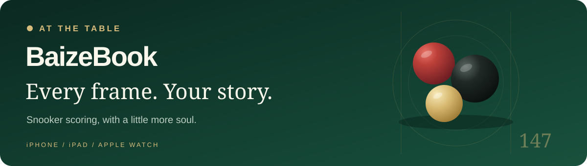
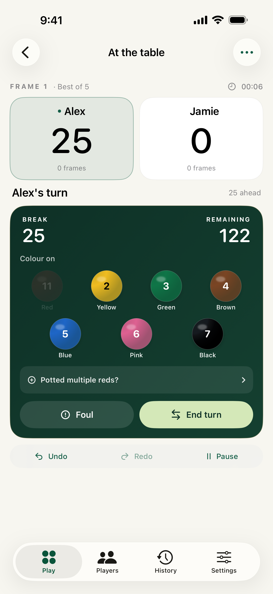
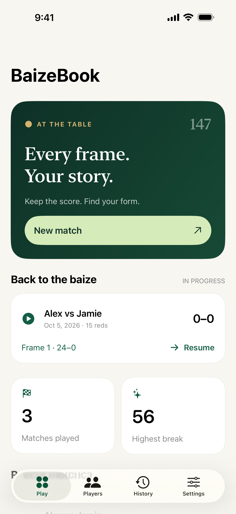
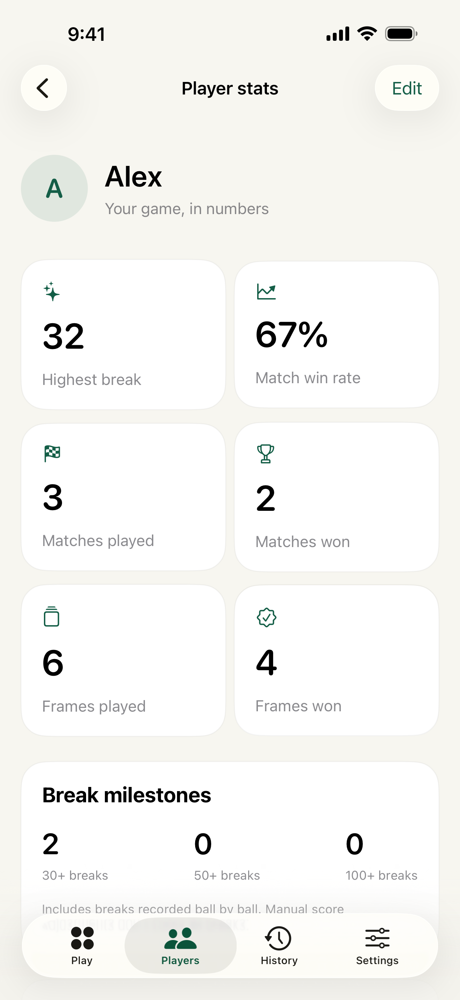
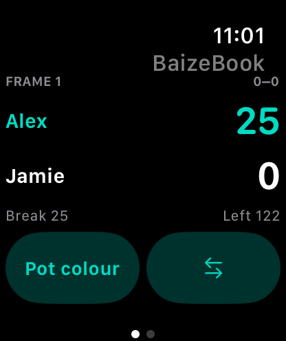

<p align="center">
  
</p>

<p align="center">
  <strong>A snooker companion made for the table.</strong><br />
  Keep the score. Find your form. Take the frame to your wrist.
</p>

<p align="center">
  
  
  
  
  
</p>

<p align="center">
  <a href="#at-the-table">The app</a> ·
  <a href="#run-it-locally">Get started</a> ·
  <a href="#under-the-baize">Architecture</a> ·
  <a href="#project-notes">Project notes</a> ·
  <a href="https://zuhayrk00.github.io/baizebook/">Support</a>
</p>

---

BaizeBook is a native iPhone, iPad and Apple Watch app for recording snooker frames and following your progress. Forest greens, warm ivory, restrained gold and native glass give it a calm, clear feel—even when the last black matters.

Players and games live on your device. There are no accounts, advertisements, subscriptions, analytics SDKs or backend services to run.

<table>
  <tr>
    <td align="center" width="33%"><strong>Keep the score</strong></td>
    <td align="center" width="33%"><strong>Back to the baize</strong></td>
    <td align="center" width="33%"><strong>Find your form</strong></td>
  </tr>
  <tr>
    <td align="center"></td>
    <td align="center"></td>
    <td align="center"></td>
  </tr>
</table>

All demonstration screenshots use fictional players **Alex and Jamie**.

## At the table

| Make it yours | Keep play moving | Remember the frame |
| --- | --- | --- |
| Choose 1–15 reds and a best-of match, or an open session with no frame limit. | Tap balls to score, or use a traditional scoreboard. Tap a player’s name to switch turns. | Review each visit, its potted balls and the break it produced. |
| Create player profiles and alternate the break-off. | See the current break, lead or deficit, points remaining and elapsed frame time. | Track highest breaks, wins, frame totals, milestones and head-to-head results. |
| Record past games with a date, scores, winner and known breaks. | Record fouls, free balls, removed reds and replay decisions. Add multiple reds immediately after potting a red. | Correct saved frames, undo or redo changes, and delete matches. |

The standard scoring screen fits on a phone without scrolling. Pause and resume the frame timer, undo a scoring action, or finish a frame with an explicit winner. Content adapts for larger accessibility text, with scrolling where needed.

### A frame on your wrist

<table>
  <tr>
    <td width="200" align="center"></td>
    <td>
      <strong>A glance for the score. A tap for the next shot.</strong><br /><br />
      The paired Watch companion shows your scores, break and frame time. With both apps connected, record pots and fouls, switch players, undo or redo, and move to the next frame.<br /><br />
      The iPhone owns the match state. A disconnected Watch can show the last received score; live scoring needs a connection to the phone.
    </td>
  </tr>
</table>

### Bring your history with you

Import a **SnookerMate JSON export** or a BaizeBook backup, preview the entries and link players before saving. Existing matches are preserved; importing the same matches again skips duplicates.

Export a backup to Files or share it with another device. Settings also offers **Clear all data** with explicit confirmation. Exported backup files remain available to restore your records.

> Statistics come from recorded frames. Manual score adjustments and foul points do not count as breaks. Completed frames count toward frame totals; completed matches count toward match totals.

## Release status

**1.0 · build 5** is available to the existing internal TestFlight group and was submitted to App Store review on **5 October 2026**. The latest verified status is **Waiting for Review**; App Store availability is pending approval.

Build 5 adds sheets that fit their content and a confirmed local-data reset. The current listing uses fresh iPhone, iPad and Watch screenshots with fictional players. See [release history](Docs/RELEASE.md), [build 5 testing notes](Docs/BUILD5_TESTING.md) and [App Store preparation](Docs/APP_STORE.md) for the recorded checks and submission details.

## Run it locally

Use a Mac with Xcode and the iOS/watchOS SDKs. The current project was built with **Xcode 27.0**. Deployment targets are **iOS/iPadOS 17** and **watchOS 10**. Native Liquid Glass styling appears on iOS 26 or later; earlier systems use native material controls.

```bash
git clone https://github.com/ZuhayrK00/baizebook.git
cd baizebook
open BaizeBook.xcodeproj
```

Choose the **BaizeBook** scheme and an iPhone or iPad simulator, then run. The Watch app is embedded in the phone target; use paired simulators to exercise WatchConnectivity. For physical devices and distribution, select your Apple development team in Signing & Capabilities.

The checked-in Xcode project is generated from [`project.yml`](project.yml). When adding files or changing target configuration, regenerate it with [XcodeGen](https://github.com/yonaskolb/XcodeGen):

```bash
xcodegen generate
```

XcodeGen is a development tool. The shipped apps have no third-party SDK dependency.

### Verification

The shared scoring engine can be tested without launching a simulator:

```bash
swift test
```

For engine, storage, Watch-command and UI checks, choose **Product → Test** in Xcode. The helper script regenerates the project and runs both test suites on a chosen simulator:

```bash
bash scripts/check.sh YOUR_IOS_SIMULATOR_UUID
```

UI tests use a separate test database. DEBUG-only `--demo` creates fictional sample records when the database is empty; demo launch flags are excluded from Release builds. The private SnookerMate fixture test skips unless `BAIZEBOOK_IMPORT_FIXTURE` points to your own local export. No personal export is bundled or committed.

### Distribution

```bash
bash scripts/archive.sh
bash scripts/upload.sh
```

These scripts require Xcode, XcodeGen, Python 3 and an authenticated Apple developer session. They verify the phone and Watch icons, privacy manifests, matching versions and Release binaries before exporting or uploading. Signing credentials, archives and IPAs are kept outside Git.

## Under the baize

| Area | Responsibility |
| --- | --- |
| [`App/`](App) | SwiftUI screens, design system, player profiles, history and the local store. |
| [`Shared/Snooker.swift`](Shared/Snooker.swift) | Scoring rules, frames, matches, undo/redo and derived statistics. |
| [`Shared/Archive.swift`](Shared/Archive.swift) | Versioned JSON backups, import validation and SnookerMate conversion. |
| [`Shared/Connectivity.swift`](Shared/Connectivity.swift) | Compact score snapshots and revision-checked Watch commands. |
| [`Watch/`](Watch) | The companion scoreboard and wrist controls. |
| [`Tests/`](Tests) · [`UITests/`](UITests) | Scoring, persistence, import, connectivity and app journeys. |
| [`Resources/`](Resources) | App icons, asset catalogs and privacy manifests. |
| [`scripts/`](scripts) | Local checks, signed packaging and upload tools. |

**Local persistence.** SwiftData stores encoded players and matches in a local SQLite database. A save completes before the visible score changes. Import validates all entries before committing them together. There is no CloudKit entitlement or Supabase dependency.

**Undo you can trust.** Scoring actions preserve their preceding state. Redo restores an undone action; a new action after undo starts a new branch. Imported legacy frames preserve original scores and declared winners rather than guessing missing play.

**One match, two devices.** Watch commands include match/frame IDs and a revision. Stale or repeated commands are rejected so a delayed tap cannot score twice.

<details>
<summary><strong>Backup format and validation</strong></summary>

Backups use the `BaizeBook` format and schema version `1`, including players and matches. Imports reject unsupported versions, missing or duplicate players, duplicate shots, invalid replay sequences, modified scores and files larger than 20 MB. Statistics are recalculated from the records.

SnookerMate exports become archived events that preserve original shots, legacy penalties and manual scores. Reimporting skips existing matches; it does not replace or update already imported matches. Optional archive, correction and redo fields keep earlier BaizeBook backups readable.

Export before removing the app or moving to another device. Apple device backups follow the user’s system settings.

</details>

## Project notes

| Guide | What’s inside |
| --- | --- |
| [Product plan](Docs/PLAN.md) | Scope, scoring decisions and references. |
| [Release history](Docs/RELEASE.md) | Builds, verification results and distribution status. |
| [TestFlight](Docs/TESTFLIGHT.md) | Installation and physical iPhone/Watch checks. |
| [Build 5 checks](Docs/BUILD5_TESTING.md) | Sheet sizing, cancellation, reset and backup restoration. |
| [App Store](Docs/APP_STORE.md) | Listing copy, review notes and screenshot conventions. |

**One repository, the whole project.** App source, project documentation and the [support and privacy site](https://zuhayrk00.github.io/baizebook/) live together here. Website source is in [`Docs/site/`](Docs/site); the `gh-pages` branch publishes only those static pages on free GitHub Pages. The repository is named `baizebook`. GitHub write access is limited to the owner; active rules prevent force pushes and deletion of project branches.

**Running cost:** no server or per-user service fees. Apple Developer membership is required for distribution, and normal platform maintenance still applies.

---

<p align="center"><strong>Made for time at the table.</strong></p>
